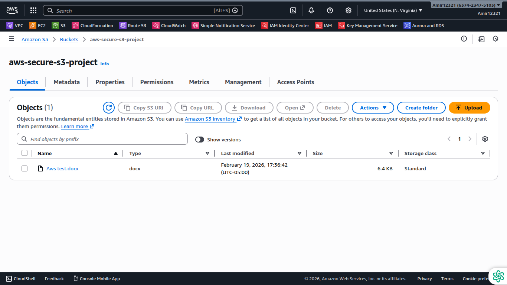

# AWS S3 Least-Privilege Access Project

This project demonstrates how to securely manage an AWS S3 bucket using least-privilege IAM policies. CloudTrail is enabled to log S3 data events for auditing and monitoring purposes. The goal is to provide controlled access while maintaining visibility for compliance and security.

---

## Key Features

- **Least-Privilege IAM Policy**: Users can only list, upload, and download objects in the designated S3 bucket.  
- **CloudTrail Logging**: Tracks all S3 data events for audit and compliance purposes.  
- **Proof of Work**: Includes screenshots and the policy JSON to demonstrate implementation.

---

## Project Screenshots

### 1️⃣ S3 Upload Proof
  
*Shows a file successfully uploaded to the S3 bucket.*

### 2️⃣ IAM Policy Proof
  
*Shows the IAM policy applied to control access to the S3 bucket.*

---

## Project Files

- [S3SecureProjectPolicy.json](S3SecureProjectPolicy.json) – Actual IAM policy JSON controlling access.

---

## Skills Demonstrated

- AWS S3 configuration  
- IAM least-privilege access control  
- CloudTrail audit logging  
- Cloud security best practices

---

## How to Use

1. Clone this repository.  
2. Review the IAM policy JSON file to understand permission boundaries.  
3. Review the screenshots for visual confirmation of S3 and IAM setup.  
4. Apply similar configurations in your own AWS account for learning or portfolio demonstration.

---

## License

This project is licensed under the [MIT License](LICENSE).  
See the LICENSE file for full details.
